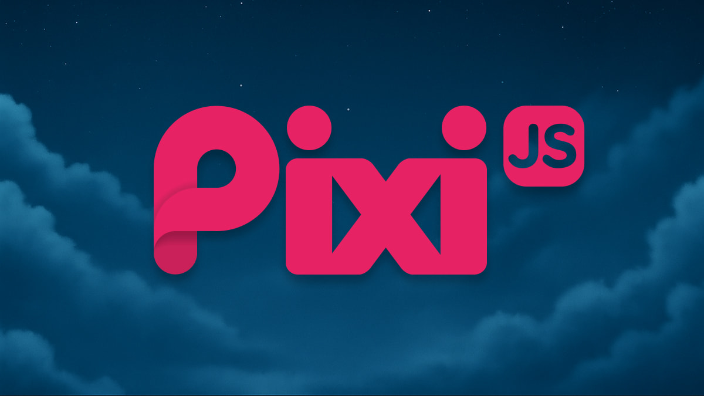
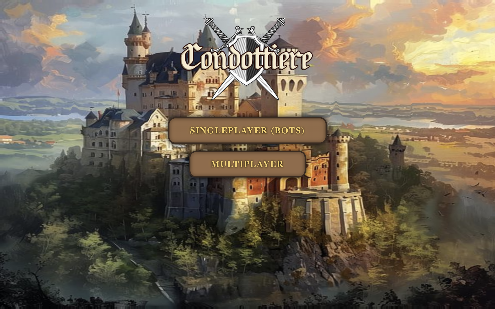
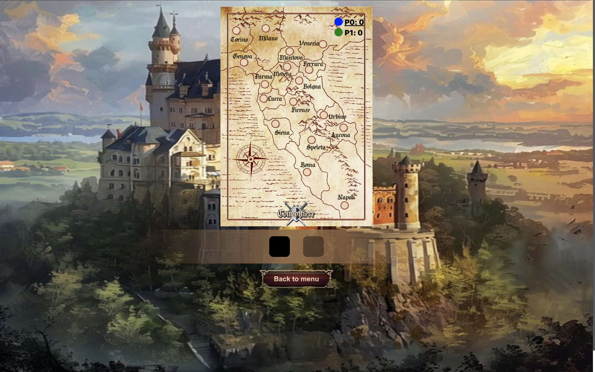
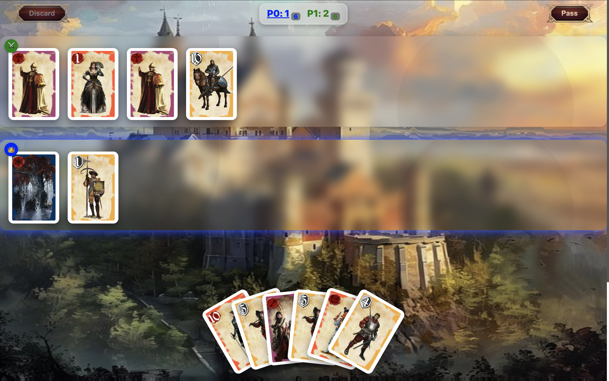

# Condottiere Board Game

<div align="center" style="text-align:center;">
  
</div>

## Introduction
A short description from [BoardGameGeek](https://boardgamegeek.com/boardgame/112/condottiere):
> The object of Condottiere is to acquire four connected provinces in renaissance Italy. Players auction off different provinces on the board and bid using a hand of cards representing mercenaries, seasons, scarecrows, and political figures. Unlike standard auctions, every player loses their bid. Special effect cards shake up the contests and keep players guessing.

## Rules
The full rules can be found [here](https://images-cdn.fantasyflightgames.com/filer_public/fe/89/fe89b26f-1524-4943-88af-a1165509cfbb/condottiere_rules_english.pdf).

## Features
- Singleplayer mode: 2–6 players with AI bots
- Multiplayer against other players
  
## Instructions
This app is built using [React](https://reactjs.org/) and [boardgame.io](https://boardgame.io/), with [Pixi.js](https://pixijs.com/) for 3D backgrounds.
<div align="center" style="display: flex; flex-direction: column; align-items: center; gap: 20px; margin-bottom: 20px;">
    
    
</div>
<div align="center" style="display: flex; flex-direction: column; align-items: center; gap: 20px; margin-bottom: 20px;">
 
</div>
   
### Client Setup
To run the client (make sure to have`npm`installed and configured):

```bash
cd "client"
npm install
npm install pixi.js
npm install @pixi/unsafe-eval
npm install @pixi/filter-displacement
npm install pixi.js@7 @inlet/react-pixi@6 --legacy-peer-deps
npm install --save-dev sass --force
npm start
```

The server shares much of the logic with the client. To simply run it (after running the client):

```bash
npm run start-server
```

## Demo
The live demo can be found [here](https://empire-opal.vercel.app/)

## What it Looks Like ?

<div align="center" style="display: flex; flex-direction: column; align-items: center; gap: 20px;">
    
    
    
</div>

## License 
The image game assets can be downloaded [here](https://ozsite.wordpress.com/2017/10/14/condottiere-version-print-play). I would like to take the opportunity to acknowledge the author and their contribution.

The code is licensed under the [GPLV3](./LICENSE) license.
